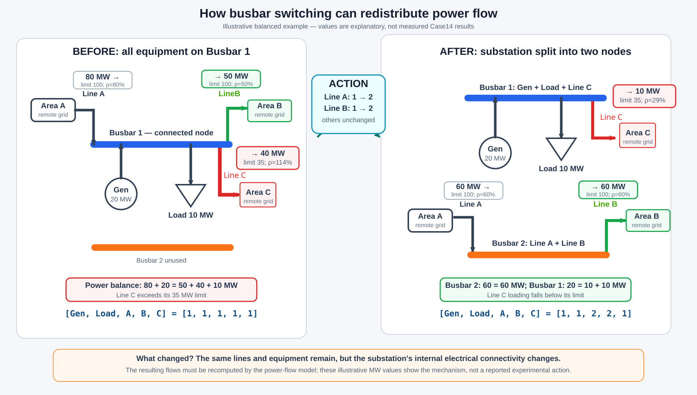
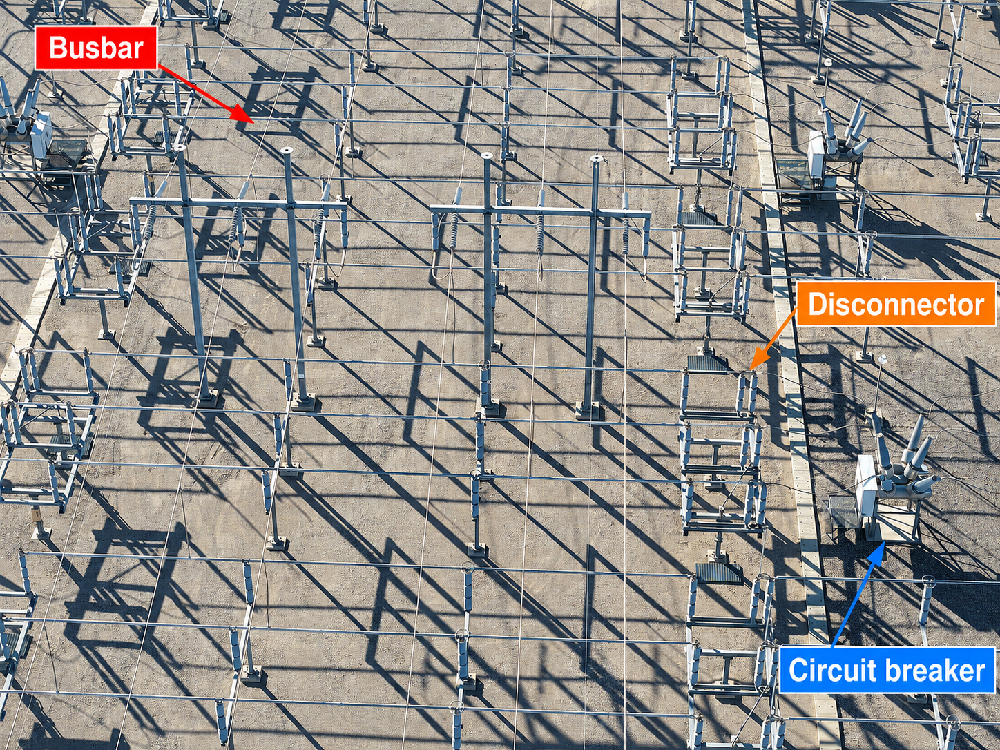
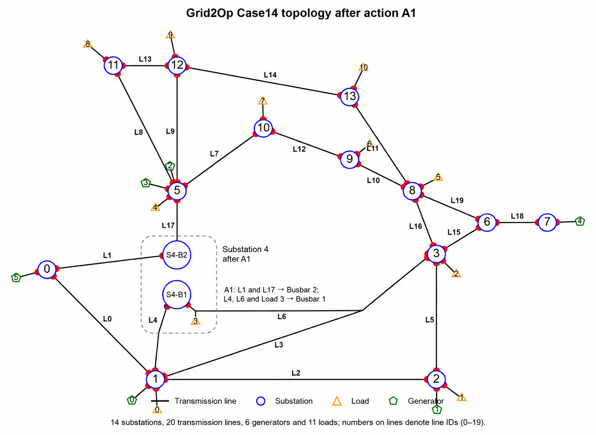
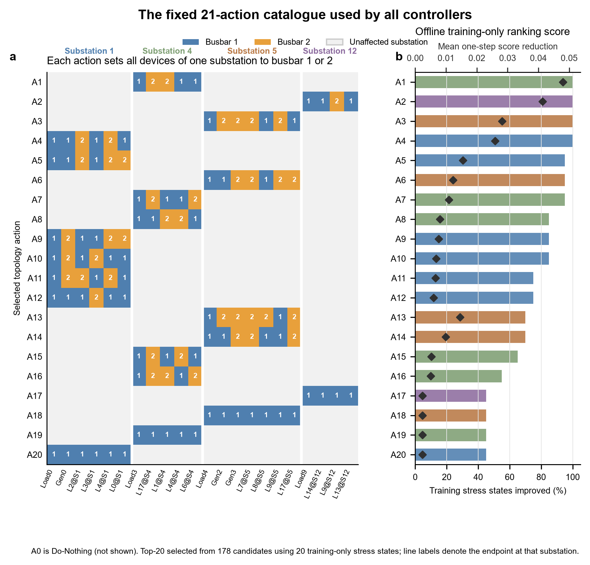
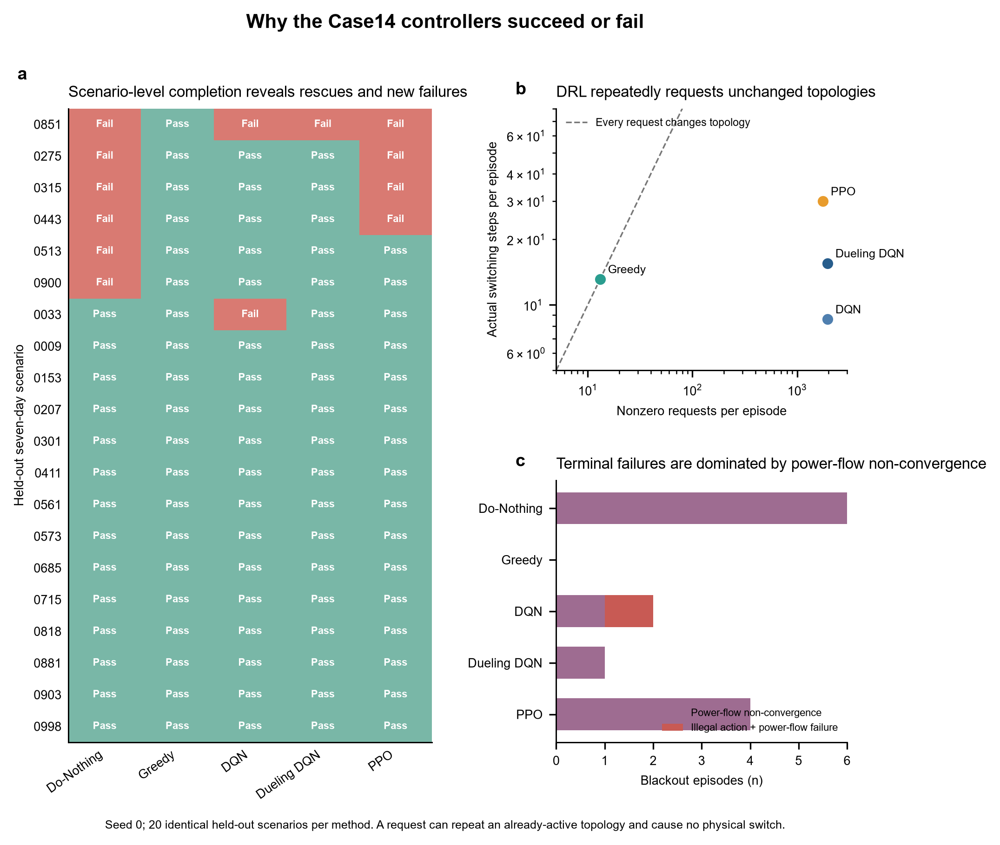
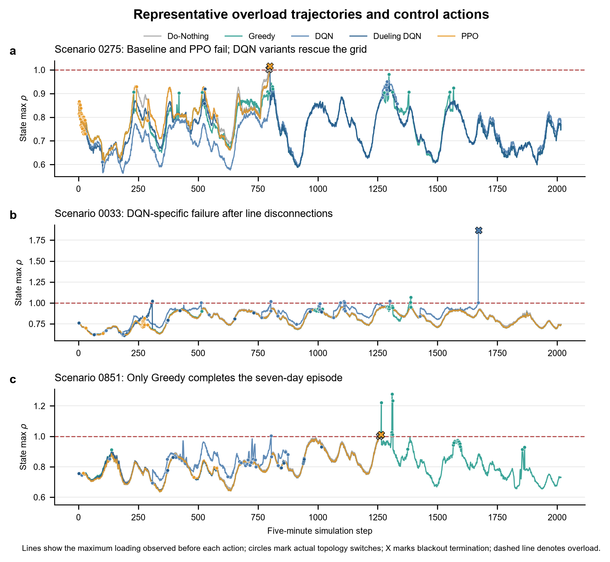

<div class="hero">
<div class="hero-kicker">POWER GRID · TOPOLOGY CONTROL · DEEP REINFORCEMENT LEARNING</div>

# Keeping a Power Grid Safe with Topology Control

<p class="hero-subtitle">
Electricity demand changes throughout the day. This changes the power carried by each
transmission line. In this study, several controllers try to prevent line overloads by
changing connections inside substations.
</p>

<div class="metric-grid">
<div class="metric-card"><div class="metric-value">14</div><div class="metric-label">Substations</div></div>
<div class="metric-card"><div class="metric-value">5 min</div><div class="metric-label">One decision step</div></div>
<div class="metric-card"><div class="metric-value">21</div><div class="metric-label">Available actions</div></div>
<div class="metric-card"><div class="metric-value">7 days</div><div class="metric-label">One test episode</div></div>
</div>
</div>

## 1. What problem are we trying to solve?

Power does not follow a route chosen by an operator. It spreads through all available
paths according to the electrical properties of the network. When generation or demand
changes, the power flow also changes. A line that was safe in the morning may become
heavily loaded later in the day.

For each transmission line $i$, Grid2Op reports a loading ratio

$$
\rho_i=\frac{\text{current carried by line }i}
{\text{thermal current limit of line }i}.
$$

::: {.rho-table}
| State | Loading ratio | Meaning |
|---|:---:|---|
| Safe | $\rho_i\leq0.90$ | Below the warning level used in this study. |
| Warning | $0.90<\rho_i\leq1.00$ | Close to the limit, but not overloaded. |
| Overloaded | $\rho_i>1.00$ | Current exceeds the line's thermal limit. |
:::

An overload does **not** mean an immediate blackout. Grid2Op can allow a short overload.
If it continues or becomes severe, protection may disconnect the line. The system reaches
blackout only when the remaining grid can no longer operate, for example after cascading
disconnections, islanding, or failure of the power-flow calculation.

> **Main question:** Can a controller change substation connections at the right time to
> reduce overloads and keep the grid operating for seven days?

## 2. What grid and data are used?

The experiment uses the IEEE 14-bus system implemented in Grid2Op. It contains 14
substations, 20 transmission lines, 6 generators, and 11 loads.

::: {.figure-panel}
{fig-alt="IEEE 14-bus test grid with numbered substations and transmission lines" width="100%"}
:::

The network layout and electrical parameters come from the downloaded
`l2rpn_case14_sandbox` environment. This project did not generate new load or generation
profiles. For this benchmark, the original line thermal limits are multiplied by 1.05;
the load and generation time series are unchanged.

### What is stored in the dataset?

Each chronic folder contains the following time series:

| File | Values at each time step | Unit |
|---|---|---|
| `load_p` | Active power demand of 11 loads | MW |
| `load_q` | Reactive power demand of 11 loads | MVAr |
| `prod_p` | Active power output of 6 generators | MW |
| `prod_v` | Voltage set points of 6 generators | kV |
| `*_forecasted` | Forecasts of the same variables | Same as the corresponding variable |

The forecast files support Grid2Op's one-step look-ahead simulation. Greedy uses this
look-ahead when it tests candidate actions. The DRL agents do not receive these forecasts
directly.

### What is a chronic?

A **chronic** is one stored time series of load and generation values. It is not one
five-minute record. Each chronic has 8,065 records at five-minute intervals, allowing up
to 8,064 transitions, or 28 days. This experiment stops each episode after 2,016 steps,
so one episode covers 7 days.

### How are the data divided?

The dataset contains 1,004 chronics. This project divides them into 702 for training, 150
for validation, and 152 for testing. The reported comparison uses 20 fixed test chronics.
Every controller receives exactly the same load and generation sequence in a given test.

| Term | Meaning in this experiment |
|---|---|
| One time step | 5 minutes |
| One episode | 2,016 steps, or 7 days |
| One test scenario | One held-out chronic used for one episode |
| Scenario `0851` | Dataset folder `chronics/0851`, not random seed 851 |

### How do these data become a grid state?

The CSV files provide inputs, not measured line flows. At each step, Grid2Op combines the
current load and generation values with the network and its current topology, then runs an
AC power-flow calculation. This produces bus voltages, line power flows, line currents,
and the loading ratio $\rho$ used by the controller. Section 4 lists the smaller set of
variables given directly to the DRL agents.

## 3. What can the controller change?

The controller cannot build a new line, reduce customer demand, or directly change
generator output. It can only change which devices are connected to Busbar 1 or Busbar 2
inside one substation.

A **busbar** is a conductor inside a substation that forms an electrical connection point.
Devices connected to the same busbar belong to the same electrical node. Moving selected
line terminals, generators, or loads to the second busbar splits one node into two nodes.
The external transmission lines remain physically unchanged, but their electrical
connections change. The next power-flow calculation can therefore distribute power
differently across the existing network.

::: {.figure-panel}
{fig-alt="Simplified before-and-after diagram of power-flow redistribution caused by substation busbar switching" width="100%"}
:::

<div class="mini-note">
<strong>How to read this diagram:</strong> no transmission line is added. The switching
action only separates equipment inside the substation into two electrical nodes. This
changes the available network paths, so the same generation and demand can produce
different line flows. The numbers are a simple illustration, not measured results from
Case14 action A1.
</div>

### What does a real busbar look like?

::: {.figure-panel}
{fig-alt="Annotated aerial photograph of a 230 kV substation, with arrows identifying a busbar, a disconnector, and a circuit breaker" width="100%"}
:::

<div class="mini-note">
<strong>How to read the photograph:</strong> the long, parallel metal conductors are the
busbars. Insulators hold them above the grounded steel frames. Circuit breakers and
disconnectors connect a transmission-line terminal to a selected busbar. The steel
frames support the equipment; they are not the busbars. Each colored label identifies one
representative device; other devices of the same type are also present. Photo: Rsparks3,
<a href="https://commons.wikimedia.org/wiki/File:Substation_busbars_and_breakers.jpg">Wikimedia Commons</a>,
<a href="https://creativecommons.org/publicdomain/zero/1.0/">CC0 1.0</a>; annotations added.
</div>

### How is topology changed in a real substation?

Changing topology is a controlled procedure, not a single button press. A typical
high-level workflow is:

1. **Plan the target topology.** Engineers check the expected power flow, equipment
   limits, and the effect of a possible failure.
2. **Approve the switching order.** The control room prepares and authorizes a written
   sequence of operations.
3. **Check the system.** Operators confirm equipment status, protection settings,
   interlocks, and communication with field staff.
4. **Control the current with circuit breakers.** Where current must be interrupted, a
   circuit breaker opens the energized circuit. A disconnector is not normally used to
   interrupt load current.
5. **Change the busbar connection with disconnectors.** After the required electrical
   conditions are satisfied, disconnectors connect a line, load, or generator bay to the
   selected busbar. The exact order depends on the substation layout.
6. **Restore and verify operation.** The required circuit breakers are closed, and the
   control room checks switch positions, voltage, current, alarms, and the new power flow.

These are only the main stages. A real switching order may contain many more checks and
operations, and trained operators must follow the approved rules for that substation.

**Grid2Op keeps only the result needed for the power-flow study.** In this simulation, an
action such as A1 directly states the final busbar assignment of the affected devices. The
environment applies that connectivity and calculates the next electrical state. 

### What does action A1 do in Case14?

Before A1, **L1, L17, L4, L6, and Load 3 are all connected to Busbar 1 at S4**. They form
one electrical node. A1 changes only the internal connections at S4:

- **S4-B2:** L1 and L17;
- **S4-B1:** L4, L6, and Load 3.

::: {.figure-panel}
{fig-alt="Case14 network after action A1, with substation S4 split into S4-B1 and S4-B2" width="100%"}
:::

The two new nodes are not directly connected inside S4. However, they can still be linked
indirectly through other substations and transmission lines. No line is added or moved.
Only its endpoint connection inside S4 changes. This changes the network equations, so the
next power-flow calculation can redistribute power over the existing lines.

## 4. What happens every five minutes?

<div class="simulation-flow">
<div class="simulation-step"><span class="step-number">1</span><div><strong>Read the new data</strong><br><span>Update load and generation, then calculate the current AC power flow.</span></div></div>
<div class="flow-arrow">&darr;</div>
<div class="simulation-step"><span class="step-number">2</span><div><strong>Choose an action</strong><br><span>The controller observes the grid and selects one of 21 actions.</span></div></div>
<div class="flow-arrow">&darr;</div>
<div class="simulation-step"><span class="step-number">3</span><div><strong>Apply the new connection</strong><br><span>Set the busbar assignment and recalculate the AC power flow.</span></div></div>
<div class="flow-arrow">&darr;</div>
<div class="simulation-step"><span class="step-number">4</span><div><strong>Record the result</strong><br><span>Measure line loading, calculate the reward, and move to the next five-minute step.</span></div></div>
</div>

The AC power-flow calculation produces voltages, power flows, and line currents. The line
current is divided by its thermal limit to obtain $\rho_i$. The controller then receives a
smaller observation vector containing the information selected for learning.

::: {.state-table}
| DRL input | Values | Purpose |
|---|---:|---|
| Line-loading ratio $\rho_i$ | 20 | Identifies lines near or above their limits. |
| Active line flow $P_i^{\mathrm{or}}$ | 20 | Describes active power at each line's origin end. |
| Active load $P_j^{\mathrm{load}}$ | 11 | Describes current demand. |
| Active generation $P_k^{\mathrm{gen}}$ | 6 | Describes current production. |
| Line status | 20 | Identifies connected lines. |
| Overload duration | 20 | Records how long each line has been overloaded. |
| Line cooldown | 20 | Shows when each line can be operated again. |
| Time of day and day of week | 4 | Describes the position in the daily and weekly cycle. |
:::

Here, $i$ indexes lines, $j$ loads, and $k$ generators.

This gives 121 input values. The current DRL input does not include the complete busbar
assignment vector $\mathbf{z}_{\mathrm{topo}}$. This missing information becomes important
when interpreting repeated actions.

### How is a decision rewarded?

In simple terms, the controller receives a positive value for keeping the grid alive and
penalties for approaching a line limit, exceeding a line limit, making an unnecessary
switch, requesting an invalid action, or reaching blackout.

::: {.callout-note collapse="true" title="Technical detail: complete reward function"}
All learning-based controllers use the same reward:

$$
\begin{aligned}
r_t ={}& 1
-5\sum_i[\max(\rho_i-0.9,0)]^2
-20\sum_i[\max(\rho_i-1,0)]^2 \\
&-0.05I_{\mathrm{switch}}
-0.5I_{\mathrm{invalid}}
-100I_{\mathrm{blackout}}.
\end{aligned}
$$

The loading terms use the state produced by the new power-flow calculation.
$I_{\mathrm{switch}}$, $I_{\mathrm{invalid}}$, and $I_{\mathrm{blackout}}$ are event
indicators: each equals 1 when that event occurs and 0 otherwise. The numerical weights
are project settings, not physical constants or universal power-system standards.
:::

## 5. Where did the 21 actions come from?

Testing every possible topology at every five-minute step would be expensive. The action
list was therefore prepared once before training:

::: {.selection-flow}
```{mermaid}
flowchart TB
    A[178 possible topology actions] --> B[20 stressed training states]
    B --> C[108 actions near heavily loaded lines]
    C --> D[Keep the best 20]
    D --> E[Add A0: Do-Nothing]
    E --> F[21 final actions]
```
:::

Only training chronics were used. The grid first followed Do-Nothing until 20 time steps
with at least one line above the 90% warning level were found. At each such state, the
three most heavily loaded lines were identified. Actions at the endpoint substations of
those lines were simulated one step ahead. This filter left 108 of the original 178
actions. The 20 actions that most often and most strongly reduced grid stress were kept;
A0 was then added.

This shortcut saves computation, but it may miss a useful action at a more distant
substation. A distant topology change can still affect flows throughout a connected grid.

::: {.callout-note collapse="true" title="Technical detail: counting and ranking the actions"}
For substation $s$, let $n_s$ be its number of connected elements and $m_s$ its number of
line endpoints. Valid two-busbar assignments are counted by

$$
C_s=2^{n_s-1}-2^{n_s-m_s}+1.
$$

Grid2Op returns these assignments as actions only when $C_s\geq2$. Summing the returned
actions over the 14 substations gives 178 candidates.

For a simulated candidate, grid stress was measured as

$$
J=\max_i(\rho_i)+5\sum_i\max(\rho_i-1,0)^2,
$$

and its one-step improvement was

$$
\Delta J=\max(J_{\mathrm{before}}-J_{\mathrm{after}},0).
$$

A larger $\Delta J$ means a larger reduction in one-step grid stress. Actions were ranked
first by how often they reduced $J$ and then by their mean improvement.
:::

### The final action catalogue

::: {.figure-panel}
{fig-alt="The 20 selected Case14 topology actions and their training-only ranking scores" width="100%"}
:::

Blue and orange cells show devices assigned to Busbar 1 and Busbar 2. Grey cells indicate
that the action does not affect that substation. A0 changes nothing. A1–A20 set a specified
busbar arrangement; they are set-point commands rather than toggle commands. Repeating an
already-active setting is a nonzero request but causes no new physical switch.

::: {.callout-note collapse="true" title="Technical detail: all 21 actions"}
| Action | Substation | Devices assigned to Busbar 2 |
|---:|---:|---|
| A0 | — | Do-Nothing; no topology change |
| A1 | S4 | L17, L1 |
| A2 | S12 | L9 |
| A3 | S5 | Gen2, Gen3, L7, L9 |
| A4 | S1 | L2, L4 |
| A5 | S1 | L2, L4, L0 |
| A6 | S5 | Gen3, L7, L9, L17 |
| A7 | S4 | L17, L6 |
| A8 | S4 | L1, L4 |
| A9 | S1 | Gen0, L4, L0 |
| A10 | S1 | Gen0, L3 |
| A11 | S1 | Gen0, L2, L4 |
| A12 | S1 | L3 |
| A13 | S5 | Gen2, Gen3, L7, L8, L17 |
| A14 | S5 | Gen3, L7, L17 |
| A15 | S4 | L17, L4 |
| A16 | S4 | L17, L1, L6 |
| A17 | S12 | Restore all S12 devices to Busbar 1 |
| A18 | S5 | Restore all S5 devices to Busbar 1 |
| A19 | S4 | Restore all S4 devices to Busbar 1 |
| A20 | S1 | Restore all S1 devices to Busbar 1 |
:::

## 6. Which controllers were compared?

All controllers choose from the same 21 actions. They differ only in how they make that
choice.

| Controller | Simple explanation |
|---|---|
| **Do-Nothing** | Always selects A0. It shows what happens without active control. |
| **Greedy** | When the grid is stressed, simulates all 21 actions and chooses the best immediate result. |
| **DQN** | Learns an expected long-term score for each action. |
| **Double DQN** | Uses separate action selection and evaluation to reduce optimistic value estimates. |
| **Dueling DQN** | Separately learns how good the current state is and which action is better. |
| **Dueling Double DQN** | Combines the Double and Dueling changes. |
| **PPO** | Learns the probability of choosing each action and limits large policy updates. |
| **A2C** | Learns an action policy and a state-value estimate together. |

Greedy is not a DRL method. It calls the simulator repeatedly during operation, which can
make it safe but slow. The DRL methods spend time learning beforehand and then select an
action with one neural-network calculation.

::: {.callout-note collapse="true" title="Technical detail: how Greedy chooses an action"}
If the maximum loading is at most 0.90, Greedy chooses A0. Otherwise, it simulates every
candidate and minimizes

$$
J(s_t,a)=\max_i\rho_{i,t+1}
+5\sum_i[\max(\rho_{i,t+1}-1,0)]^2
+0.01I(a\ne A0).
$$

This internal score selects the action. It is not the reported episode reward. After the
chosen action is executed, Greedy is evaluated with the same common reward as every other
controller.
:::

::: {.callout-note collapse="true" title="Technical detail: DQN, PPO, and A2C"}
DQN learns an action value $Q(s,a)$ and selects the action with the largest value. Every
DQN variant has an Online network that learns and selects actions and a delayed Target
network that stabilizes the learning target. Dueling DQN represents

$$
Q(s,a)=V(s)+A(s,a)-\frac{1}{21}\sum_{a'}A(s,a').
$$

PPO and A2C use an Actor–Critic structure instead. The Actor chooses actions; the Critic
estimates how good the state is. PPO uses clipped updates to prevent the policy from
changing too far at once. A2C uses shorter rollouts and more direct updates.

The reported models were trained for 500,000 steps. DQN-family networks use two hidden
layers of 128 units, $\gamma=0.99$, a replay buffer of 100,000 transitions, batch size
128, and a target update every 2,000 steps. PPO uses 1,024-step rollouts, batch size 128,
10 epochs, and clip range 0.20. A2C uses 20-step rollouts. These are implementation
settings, not physical grid parameters.
:::

## 7. How was performance measured?

The test asks whether each controller can survive the complete seven-day scenario while
avoiding excessive overload and computation.

| Metric | What it answers | Better direction |
|---|---|:---:|
| **Completion rate** | How many test episodes reached all 2,016 steps? | Higher |
| **Blackout rate** | How many episodes ended before seven days? | Lower |
| **Mean episode length** | How long did the grid operate on average? | Higher |
| **Overload-step ratio** | In what percentage of operating steps was at least one line above $\rho=1$? | Lower |
| **Actual switching steps** | How often did the physical topology really change? | Depends on safety |
| **Inference time** | How long did one action decision take? | Lower |

The comparison uses the same 20 held-out seven-day chronics for every method. The reported
models use training seed 0, so the results are a preliminary comparison rather than proof
that one neural architecture is always superior.

## 8. What were the results?

<div class="result-grid">
<div class="result-card"><div class="result-number">100%</div><div class="result-title">Greedy completion</div><div class="result-text">Safest method in this test.</div></div>
<div class="result-card"><div class="result-number">95%</div><div class="result-title">Dueling DQN completion</div><div class="result-text">Best learned controller.</div></div>
<div class="result-card"><div class="result-number">0.055%</div><div class="result-title">Dueling DQN overload ratio</div><div class="result-text">Second lowest after Greedy.</div></div>
<div class="result-card"><div class="result-number">0.781 ms</div><div class="result-title">Dueling DQN decision time</div><div class="result-text">Fast online decisions.</div></div>
</div>

::: {.figure-panel}
{fig-alt="Completion, overload, and decision-time comparison across all controllers" width="100%"}
:::

**Panel a — Can the controller finish seven days?** Higher is better. Greedy completed
all 20 scenarios. Dueling DQN completed 19 and was the strongest DRL method.

**Panel b — How often was any line overloaded?** Lower is better. Greedy had the lowest
overload burden, followed by Dueling DQN.

**Panel c — What is the safety–speed trade-off?** Points higher on the chart are safer;
points farther left decide faster. Greedy was safest but slowest. Dueling DQN provided
the strongest safety–speed balance among the learned methods.

| Method | Completion | Blackout | Mean steps | Overload ratio | Actual switches | Decision time |
|---|---:|---:|---:|---:|---:|---:|
| **Greedy** | **100%** | **0%** | **2016.0** | **0.0446%** | 13.15 | 38.195 ms |
| **Dueling DQN** | **95%** | **5%** | 1978.4 | **0.0550%** | 15.55 | 0.781 ms |
| DQN | 90% | 10% | 1961.2 | 0.0750% | **8.60** | **0.266 ms** |
| PPO | 80% | 20% | 1767.8 | 0.0591% | 30.00 | 0.505 ms |
| Double DQN | 75% | 25% | 1746.1 | 0.2560% | 40.75 | 0.905 ms |
| A2C | 70% | 30% | 1646.3 | 0.0889% | 0 | 0.500 ms |
| Do-Nothing | 70% | 30% | 1646.3 | 0.0889% | 0 | 0.001 ms |
| Dueling Double DQN | 10% | 90% | 1045.9 | 0.7371% | 73.25 | 0.743 ms |

## 9. Why did the controllers behave differently?

The results show **what happened**. The explanations below are plausible reasons that
still need controlled experiments.

### Why was Greedy safe but slow?

When the grid became stressed, Greedy tried every candidate in the simulator before
acting. This gave it strong immediate safety information, but required many extra
power-flow calculations.

### Why might Dueling DQN have worked well?

Most five-minute states were already safe and many actions had similar effects. Dueling
DQN separately asks “Is this state generally safe?” and “Which action is better here?”
That separation may have helped it recognize the smaller number of states that needed a
useful intervention.

### Why did A2C match Do-Nothing?

A2C made no real topology changes. Safe states were common, and the agent could often
receive a positive survival reward without switching. It may therefore have learned to
prefer A0. Its short 20-step updates may also have made rare failures harder to learn from.

### Why did some DRL agents request thousands of actions?

A1–A20 specify target busbar settings. If a requested setting is already active, the
request is nonzero but nothing physically changes. The DRL observation does not include
the full busbar assignment, so an agent may repeatedly request a topology that is already
present. Greedy is less affected because it simulates the predicted outcome before acting.

| Method | Nonzero requests per episode | Actual switching steps | Requests causing a switch |
|---|---:|---:|---:|
| Greedy | 13.15 | 13.15 | 100.000% |
| Dueling DQN | 1959.40 | 15.55 | 0.794% |
| DQN | 1960.10 | 8.60 | 0.439% |
| PPO | 1767.75 | 30.00 | 1.697% |
| Do-Nothing | 0 | 0 | Not applicable |

::: {.callout-warning title="Result versus explanation"}
The benchmark confirms that the methods performed differently. It does not yet prove
that a specific network design caused the difference. Multiple training seeds and
controlled ablation tests are required.
:::

## 10. Optional diagnostic details

The following analysis is useful for investigating individual failures, but it is not
required to understand the main comparison.

::: {.callout-note collapse="true" title="Which 20 test scenarios were used?"}
The scenario IDs are dataset folder names:

```text
0009, 0033, 0153, 0207, 0275, 0301, 0315, 0411, 0443, 0513,
0561, 0573, 0685, 0715, 0818, 0851, 0881, 0900, 0903, 0998.
```

Their stored load and generation values are not regenerated during evaluation. Every
controller is tested on the same sequences.
:::

::: {.callout-note collapse="true" title="Scenario outcomes and action efficiency"}
{fig-alt="Scenario completion, action requests versus real switches, and terminal failure categories" width="100%"}

Panel a shows completion for each scenario. Panel b separates a requested nonzero action
from a real topology change. Panel c summarizes the terminal exceptions. Most failed
episodes ended with AC power-flow non-convergence, which describes the final stopping
event rather than the complete initiating cause.
:::

::: {.callout-note collapse="true" title="Representative overload trajectories"}
{fig-alt="Maximum line-loading trajectories for Scenarios 0275, 0033, and 0851" width="100%"}

The red dashed line is $\rho=1$. Circles mark physical topology switches and an X marks
episode termination. Scenario 0275 is a baseline failure rescued by the DQN variants.
Scenario 0033 shows a DQN-specific failure. In Scenario 0851, only Greedy completed all
2,016 steps.
:::

::: {.callout-note collapse="true" title="DQN failure in Scenario 0033"}
| Step | Action | Logged event |
|---:|---:|---|
| 1669 | A17 | Line 9 was slightly overloaded; the grid continued operating. |
| 1670 | A9 | Lines 9 and 13 disconnected; maximum loading rose from about 1.00 to 1.86. |
| 1671 | A2 | Grid2Op rejected the request as illegal; the episode continued. |
| 1672 | A2 | The warning recurred and the AC power flow failed to converge. |

The illegal request should not be treated as proof that it alone caused blackout. The grid
was already severely stressed after the line disconnections, and the repeated request did
not provide a feasible recovery before power-flow non-convergence.
:::

## 11. What can and cannot be concluded?

The current experiment supports three clear statements:

1. Greedy was the safest controller in these 20 test scenarios, but it required much more
   computation per decision.
2. Dueling DQN was the strongest DRL controller in this seed-0 comparison.
3. Several learned policies repeatedly requested already-active topology settings.

It does **not** yet show that Dueling DQN is always the best DRL architecture. The models
were trained with only one seed, and only 20 of the 152 held-out test chronics were included
in the reported comparison.

The next experiments should train several seeds, evaluate the complete test split, add
`topo_vect` to the observation, record action frequencies, and test a mask or penalty for
redundant requests.

::: {.callout-tip title="Main takeaway"}
Topology control can reduce overload without adding lines or changing demand. Greedy gave
the strongest safety result, while Dueling DQN offered the best balance of safety and fast
online decision making among the learned controllers in this preliminary benchmark.
:::

## 12. Is there still research potential?

**Short answer: yes, but not in a simple comparison of DRL algorithms.** Many researchers
already study grid topology control, busbar splitting, Grid2Op, and action-space reduction.
The research question must therefore go beyond applying DQN, PPO, or A2C to Case14.

### What has already been studied?

| Topic | Current position | Relation to this project |
|---|---|---|
| Transmission-line switching | A well-established field. [Optimal Transmission Switching](https://ieeexplore.ieee.org/document/4492805/) formulated line-status selection as an optimization problem in 2008. | Changing network topology is not a new idea. |
| Busbar splitting | Existing optimization methods already use substation busbar splitting to reduce congestion and operating cost. They have been tested on IEEE 14-bus and 118-bus systems. [NREL study](https://www.nrel.gov/docs/fy21osti/78184.pdf) | The physical action used here has already been studied. |
| Grid2Op and RL control | The L2RPN challenge attracted more than 300 participants and produced several strong learning and search-based controllers. [L2RPN retrospective](https://proceedings.mlr.press/v133/marot21a.html) | Using Grid2Op with RL is now an active research area. |
| Reducing the RL action space | Existing L2RPN solutions commonly restrict the large topology-action space. [State and Action Factorization](https://arxiv.org/abs/2409.04467) | Reducing 178 actions to a smaller set is not sufficient novelty by itself. |
| Selecting busbar actions before RL training | A 2024 study used power-flow sensitivity factors to select substation-reconfiguration actions before training an RL controller on an IEEE 14-bus system. [PTDF-based selection study](https://doi.org/10.1016/j.eswa.2024.125017) | This is particularly close to the present action-selection procedure. |

### What is the possible research gap?

The current benchmark fixes the catalogue at 20 topology actions. This number was chosen
by the experiment design; it was **not** shown to be optimal. Three different questions
should be separated:

1. **Switching locations:** which substations or equipment terminals should be controllable?
2. **Action catalogue size:** how many topology configurations should the controller be
   allowed to choose from?
3. **Actual operations:** how many physical switching operations should be permitted during
   one episode?

A useful next study could optimize these three choices together. For example, the same
controller could be retrained with 5, 10, 20, 30, 50, and 108 candidate actions. The results
would show how safety, computation, and switching frequency change as more control options
are added. A further step would select the substations that should have remotely controllable
switching equipment, instead of assuming that every location is available.

> **Possible research question:** What is the smallest set of controllable switching
> locations and topology actions that allows a DRL controller to keep the grid safe under
> changing load and generation conditions?

### Honest assessment

| Scope | Research potential |
|---|---|
| Compare standard DRL algorithms on one Case14 experiment | Low; this is mainly a benchmark or teaching example. |
| Replace the current Top-20 rule with another action-ranking rule | Limited; closely related action-selection methods already exist. |
| Systematically optimize catalogue size and report the safety--cost trade-off | Moderate; useful if tested with multiple seeds and unseen scenarios. |
| Jointly select physical switching locations, the action catalogue, and the operating policy | More promising; it connects hardware availability with intelligent operation. |

The last direction is promising, but it should not yet be described as a new method. A more
complete literature review is needed to check whether the same combined problem has already
been solved. Any future claim should also be supported by multiple training seeds, larger
test sets, and preferably more than one grid.

::: {.callout-note title="How this assessment was prepared"}
This section is a preliminary literature map produced through a ChatGPT-assisted literature
search and synthesis on 5 September 2026. It is intended to identify relevant research
directions, not to replace a systematic review.
:::
