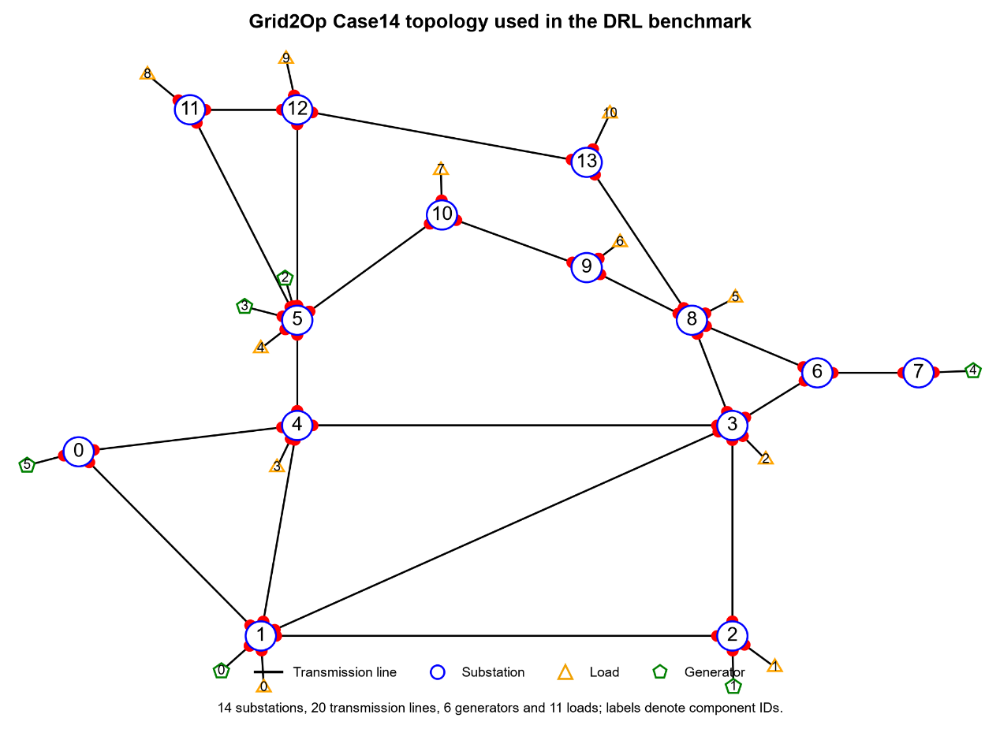
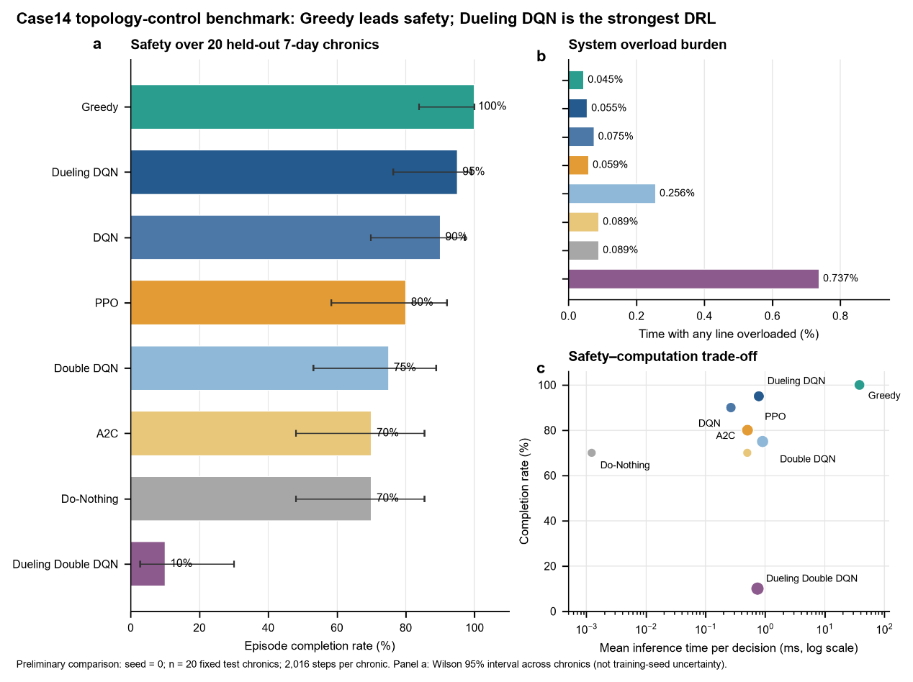

<div class="hero">
<div class="hero-kicker">POWER GRID · DEEP REINFORCEMENT LEARNING · TOPOLOGY CONTROL</div>

# Deep Reinforcement Learning for Power Grid Topology Control

<p class="hero-subtitle">
This study evaluates whether deep reinforcement learning can improve power-grid security
by changing substation busbar connections, redistributing power flows, and reducing
transmission-line overloads.
</p>

<div class="metric-grid">
<div class="metric-card">
<div class="metric-value">IEEE 14-bus</div>
<div class="metric-label">Test system</div>
</div>
<div class="metric-card">
<div class="metric-value">5 min</div>
<div class="metric-label">Decision interval</div>
</div>
<div class="metric-card">
<div class="metric-value">21</div>
<div class="metric-label">Available actions</div>
</div>
<div class="metric-card">
<div class="metric-value">95%</div>
<div class="metric-label">Best DRL completion rate</div>
</div>
</div>
</div>

## Research question

Power generation and load demand vary over time, which can create highly loaded operating
conditions. The central question in this work is:

> **Can a reinforcement-learning agent use topology reconfiguration to reduce line overloads
> and prevent blackouts while remaining fast enough for online decision making?**

The control actions do **not** add transmission lines or reduce electricity demand.
Instead, they change the busbar connections inside a substation so that power flows are
redistributed through the existing network.

## Test system

The study uses the IEEE 14-bus power grid implemented in **Grid2Op**. It contains
14 substations, 20 transmission lines, 6 generators, and 11 loads. Power generation and
load demand change every five minutes.

::: {.figure-panel}
{fig-alt="Grid2Op Case14 topology showing substations, transmission lines, generators, and loads" width="100%"}
:::

<div class="mini-note">
<strong>Episode definition:</strong> each episode represents seven days, corresponding to
2,016 five-minute time steps.
</div>

## DRL topology-control framework

```{mermaid}
flowchart LR
    A["Current grid state"] --> B["DRL agent"]
    B --> C["Select one of 21 actions"]
    C --> D["Change busbar connection<br/>or Do Nothing"]
    D --> E["Power-flow redistribution"]
    E --> F["Line loading / grid security"]
    F --> A
```

At each time step, the agent observes the current grid state and selects one action.
The resulting topology determines how power is redistributed before the next decision.

## Action-space design

The action space is fixed before DRL training so that all learning algorithms and the
Greedy controller are compared using exactly the same actions.

```{mermaid}
flowchart LR
    A["178 candidate<br/>topology actions"] --> B["Test on 20 highly<br/>loaded grid states"]
    B --> C["Rank by overload reduction<br/>and valid power flow"]
    C --> D["Select best 20<br/>topology actions"]
    D --> E["+ 1 Do-Nothing action"]
    E --> F["21-action<br/>benchmark space"]
```

The 178 original actions change busbar connections within one substation. They are tested
on 20 highly loaded states from the training data and ranked according to their ability to
reduce line loading without producing an invalid power flow. The best 20 are retained,
together with one Do-Nothing action.

## Methods compared

<div class="method-grid">
<div class="method-card"><strong>DQN</strong><span>Value-based DRL baseline</span></div>
<div class="method-card"><strong>Double DQN</strong><span>Double-estimator DQN variant</span></div>
<div class="method-card"><strong>Dueling DQN</strong><span>Dueling value–advantage architecture</span></div>
<div class="method-card"><strong>PPO</strong><span>Policy-optimization method</span></div>
<div class="method-card"><strong>A2C</strong><span>Actor–critic method</span></div>
<div class="method-card"><strong>Dueling Double DQN</strong><span>Combined DQN variant</span></div>
<div class="method-card baseline"><strong>Greedy</strong><span>Non-learning baseline</span></div>
<div class="method-card baseline"><strong>Do-Nothing</strong><span>No-control baseline</span></div>
</div>

## Evaluation metrics

The methods are evaluated using six complementary indicators:

| Metric | Interpretation | Desired direction |
|---|---|---|
| **Completion Rate** | Percentage of test episodes completing all 2,016 steps | Higher |
| **Blackout Rate** | Percentage of episodes ending early because the grid can no longer operate | Lower |
| **Mean Episode Length** | Average number of operating steps completed | Higher |
| **Overload-Step Ratio** | Percentage of operating steps with at least one overloaded line | Lower |
| **Mean Actual Switching Steps** | Average number of time steps in which topology is actually changed | Context dependent |
| **Mean Inference Time** | Average computation time required to select one action | Lower |

## Key results

<div class="result-grid">
<div class="result-card">
<div class="result-number">100%</div>
<div class="result-title">Greedy completion rate</div>
<div class="result-text">Highest security performance in the benchmark.</div>
</div>
<div class="result-card">
<div class="result-number">95%</div>
<div class="result-title">Dueling DQN completion rate</div>
<div class="result-text">Best-performing DRL method.</div>
</div>
<div class="result-card">
<div class="result-number">0.055%</div>
<div class="result-title">Dueling DQN overload ratio</div>
<div class="result-text">Second lowest overload burden after Greedy.</div>
</div>
<div class="result-card">
<div class="result-number">0.781 ms</div>
<div class="result-title">Dueling DQN inference time</div>
<div class="result-text">Sub-millisecond online action selection.</div>
</div>
</div>

::: {.figure-panel}
{fig-alt="Comparison of completion rate, overload burden, and safety-computation trade-off across topology-control methods" width="100%"}
:::

The figure summarizes three aspects of performance:

**a. Episode completion rate.** Higher is better. Greedy reaches 100%, while
Dueling DQN is the strongest DRL method at 95%.

**b. System overload burden.** Lower is better. Greedy has the lowest overload-step
ratio (0.0446%), followed by Dueling DQN (0.0550%).

**c. Safety–computation trade-off.** A favorable method combines high completion rate
with low inference time. Dueling DQN provides the strongest safety–speed balance among
the DRL methods, whereas Greedy is safer but substantially slower in this benchmark.

<div class="mini-note">
<strong>Benchmark note:</strong> the supplied comparison figure reports seed = 0,
20 fixed held-out seven-day chronics, and 2,016 steps per chronic. The error bars in panel
(a) are Wilson 95% intervals across chronics and do not represent training-seed uncertainty.
</div>

## Detailed performance

| Method | Completion Rate | Blackout Rate | Mean Episode Length | Overload-Step Ratio | Mean Actual Switching Steps | Mean Inference Time |
|---|---:|---:|---:|---:|---:|---:|
| **Greedy** | **100%** | **0%** | **2016.0** | **0.0446%** | 13.15 | 38.195 ms |
| **Dueling DQN** | **95%** | **5%** | 1978.4 | **0.0550%** | 15.55 | 0.781 ms |
| DQN | 90% | 10% | 1961.2 | 0.0750% | **8.60** | **0.266 ms** |
| PPO | 80% | 20% | 1767.8 | 0.0591% | 30.00 | 0.505 ms |
| Double DQN | 75% | 25% | 1746.1 | 0.2560% | 40.75 | 0.905 ms |
| A2C | 70% | 30% | 1646.3 | 0.0889% | 0 | 0.500 ms |
| Do-Nothing | 70% | 30% | 1646.3 | 0.0889% | 0 | 0.001 ms |
| Dueling Double DQN | 10% | 90% | 1045.9 | 0.7371% | 73.25 | 0.743 ms |

## Main findings

::: {.callout-tip title="Takeaway 1 — Best overall security"}
**Greedy** achieves the highest episode completion rate and the lowest overload burden,
making it the strongest security benchmark in the current comparison.
:::

::: {.callout-important title="Takeaway 2 — Best DRL method"}
**Dueling DQN** is the strongest DRL method, reaching a 95% completion rate and a
0.0550% overload-step ratio while maintaining sub-millisecond inference time.
:::

::: {.callout-note title="Takeaway 3 — Fast DRL decision making"}
**DQN** has the lowest inference overhead among the tested DRL methods and requires fewer
actual topology-switching steps than the other active DRL controllers in the supplied results.
:::

::: {.callout-warning title="Takeaway 4 — Policy instability"}
**Dueling Double DQN** performs poorly in the supplied benchmark, with a 10% completion
rate, 90% blackout rate, and the highest overload-step ratio, indicating significant
policy instability in this experiment.
:::

## Research message

This benchmark demonstrates a clear distinction between **maximum security performance**
and **fast learned decision making**. Greedy provides the strongest overall security,
whereas Dueling DQN offers the most competitive DRL balance between episode survival,
overload mitigation, and online inference speed.

---

<div class="footer-note">
This page is structured as a research showcase: <strong>problem → system → method →
benchmark → results → findings</strong>. It can be expanded later with training details,
reward design, state representation, hyperparameters, additional test seeds, or larger
power-grid cases when those results are available.
</div>
